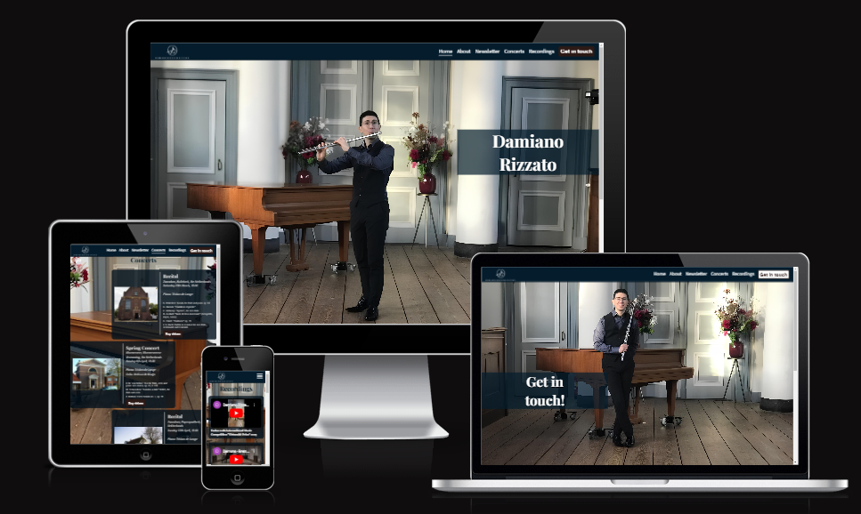
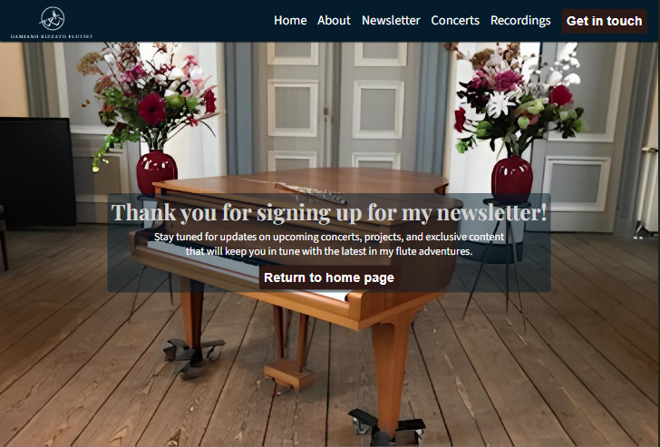
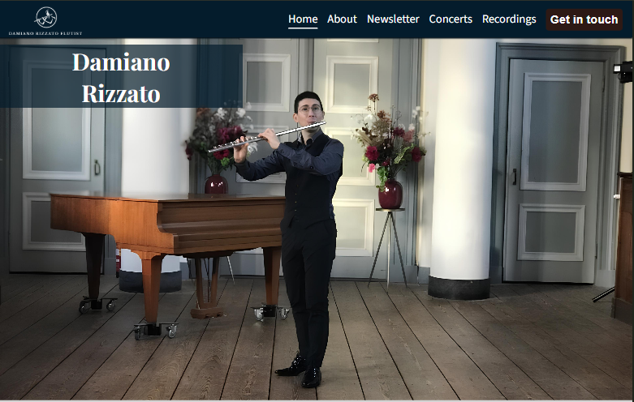
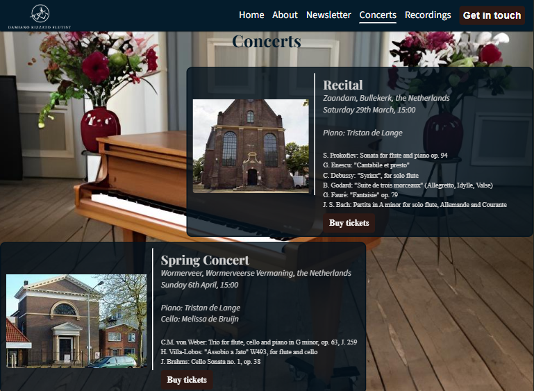
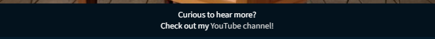

<h1>Damiano Rizzato - Flutist</h1>
Welcome to the official professional website of Damiano Rizzato, created to connect venues, artistic directors, classical music enthusiasts, and Instagram followers with Damiano.

This website serves as a landing page that allows various visitors, most likely adults, located in the Zaanstad area in the Netherlands, to:

<ul>
<li>Discover more about his background and career;</li>
<li>Stay updated on his concerts and projects;</li>
<li>Listen to his recordings;</li>
<li>Contact him to discuss concert and project ideas or to book him for an event;</li>
</ul>

The primary business objective is to help the flutist secure more performance opportunities, emphasized by the prominent "Get in touch" button in the website's navigation bar.

Link to deployed website: <a href="https://dr-developer98.github.io/Damiano-Rizzato-Flutist---Project-1-HTML-CSS/" target="_blank">Damiano Rizzato - Flutist</a>

Link to repository: <a href="https://github.com/DR-developer98/Damiano-Rizzato-Flutist---Project-1-HTML-CSS" target="_blank">Damiano-Rizzato-Flutist---Project-1-HTML-CSS</a>

<h2>Relevant User Stories</h2>
The foundation of this website is built on the following user stories:

<ol>
<li id="US1">As an Instagram follower, I want to find a biography section, so I can learn more about Damiano's background.</li>
<li id="US2">As a regular classical concert attendee, I want to see a list of upcoming performances with clear details about time, date, venue, and program, so I can find events that interest me and fit my schedule.</li>
<li id="US3">As a classical music enthusiast, I want to subscribe to Damiano's newsletter, so I can receive updates on his upcoming performances, new recordings, and behind-the-scenes insights directly in my inbox.</li>
<li id="US4">As a classical music enthusiast, I want easy access to Damiano's social media profiles, so I can stay updated with his latest activities, performances, and content on various platforms.</li>
<li id="US5">As the manager of a concert venue, I want to listen to some of Damiano's recordings, so I can determine if he's a good fit for the concert I am organizing.</li>
<li id="US6">As an artistic director, I want to get in touch with Damiano, so I can discuss concert and project ideas with him.</li>
</ol>

<h2>Features</h2>

<h3>Navigation bar</h3>
<ul>
<li>The navigation bar is displayed on all five pages (homepage, concerts, recordings, get in touch and success pages), it's fully responsive and presents the logo (which enables navigation to the home page), all navigation links as well as two in-page links, namely Newsletter and About.</li>
<li>This section enables seamless navigation across all devices, allowing users to move from page to page without needing to use the 'back' button.</li>
</ul>

<h3>Footer</h3>
The footer section, which appears on all website pages and is fully responsive on all major screen sizes, comprises two key elements:
<ul>
<li><strong>the newsletter section:</strong> accessible from any page via an in-page link ("Newsletter") in the navbar, this section includes a short call to action and an email input field for users to sign up. Clicking on "sign up" will redirect the user to a feedback page, with a short thank-you-for-signing-up text as well as a "Return to homepage" button.
 
<strong style="color: red">Note:</strong> on many websites, the feedback given to the users upon signing up for a newsletter is a strip of text appearing below the email input field. As this requires JavaScript and as I didn't possess the right set of skills at the time of me designing this website, I chose to create a whole feedback page.</li>

<li><strong>the social media section:</strong> this section includes links to all of the flutist's relevant social media sites. These links open in a new tab, ensuring easy navigation for the user.</li> 
</ul>
The footer section addresses the <a href="#US3">third</a> and <a href="#US4">fourth</a> user stories, enabling users to receive updates on upcoming concerts, projects, and recordings directly in their mailbox, as well as easily navigate to the flutist's various social media profiles to view the different types of content he publishes.

<h3>Landing page image</h3>
The landing page includes a photograph of Damiano with text overlay with his full name.
This section introduces the user to the flutist with a photo from one of his performances.

<h3>About</h3>
The About section, located in the homepage directly under the hero-image, serves the user in that it directly addresses the <a href="#US1">first</a> user story, providing them with the flutist's background information. This section is accessible from all pages by means of the "About" nav link.

<h3>Concerts</h3>
The concerts page lists upcoming performances with details like venue, date, time, program, and collaborators' names. Each card consists of two parts:
<ul>
<li>Venue picture, which upon clicking will redirect the user to the venue's homepage;</li>
<li>Concert description section, which includes all useful information as well as a "Buy tickets" button that - currently - links to the venue's homepage. </li>
</ul> 

This section addresses the <a href="#US2">second user story</a> in that it provides regular concert goers with basic relevant information about the time and the location of the listed events, so that one can see what fits into their schedule, and because it lists the repertoire that is going to be presented, it ensures that attendees are well-informed and can plan their visits accordingly, contributing to a more engaging and organized concert-going experience.

<strong style="color: red">Note:</strong> dates, times, programs and the musicians' names are all fictional, therefore any reference to real people and events is purely coincidental. This section will be updated with real events in the future.

<h3>Recordings</h3>
The recordings page features eight highlight recordings from Damiano's YouTube channel and a link to the full channel at the bottom. This section will regularly be updated with the flutist's latest recordings.
This feature addresses the <a href="#US5">fifth user story</a>, providing artistic directors and venues the possibility to easily access and review the latest performances and works by Damiano, helping them make informed decisions regarding potential bookings and collaborations. 

<h3>Get in touch</h3>
This page will allow primarily concert venue managers and artistic directors to get in touch with Damiano, in order to discuss concert and project ideas with him. This page consists of two elements:
<ul>
<li><strong>a hero image with a text overlay</strong></li>

<li><strong>the get-in-touch form</strong>, where the user will be able to specify the subject of their query/proposal and to type out their message in the textarea.

The form consists of three text input fields (Name, Query subject, Message) and one e-mail input field.
All the fields must be filled in, in order to meet the form submission requirements. After clicking on submit, the user will be redirected to a feedback page, which comprises a short thank-you-for-reaching-out text as well as a "Return to homepage" button.
</li>

</ul>

This feature makes sure the <a href="#US6">sixth user story</a> is implemented, enabling artistic diectors to reach out to Damiano.

<h3>Future implementations</h3>
<ul>
<li><strong>Newsletter:</strong> in the future the newsletter section will be integrated with JavaScript in order to enable the appearance of a feedback text below the e-mail input field or a modal. Herewith the Feedback newsletter page will cease to be necessary and will be deleted. The integration of JavaScript will enable user input data to automatically trigger the sending of a confirmation email to the user's mailbox. </li>
<li><strong>Concerts page:</strong> this page will be updated with information regarding actual events/concerts/projects and actual collaborators' names. The venue images will still redirect the user to the venue website homepage, but the "Buy tickets" buttons will actually redirect the user to the page where they'll be able to purchase tickets for the selected concert.</li>
<li><strong>Recordings page:</strong> this page will be kept updated with the most recent video performances from Damiano's YouTube channel.</li>
<li><strong>Social media icons in the footer:</strong> in the future each social media icon will redirect the user to Damiano's accounts instead of the social network login page.</li>
</ul>

<h2>Testing</h2>

Please refer to <a href="TESTING.md">TESTING.md</a>

<h2>Deployment</h2>

The site was deployed to GitHub pages. 
The steps to deploy are as follows:
<ol>
<li>Navigate to the GitHub Repository;</li>
<li>Click on the "Settings" tab on the top navigation bar;</li>
<li>Click on "Pages" on the left navigation menu";</li>
<li>Ensure the "Source" is set to "Deploy from a Branch";</li>
<li>Ensure the "Branch" is set to "Main"</li>
<li>Click on "Save";</li>
<li>The page will be automatically refreshed with a detailed ribbon display to indicate the successful deployment.</li>
</ol>

Here is the link to the deployed version: <a href="https://dr-developer98.github.io/Damiano-Rizzato-Flutist---Project-1-HTML-CSS/" target="blank">Damiano Rizzato - Flutist</a>

<h2>Credits</h2>

<h3>Content</h3>

<ul>
<li>Code for structure navbar, nav-toggle, structure footer, position of hero-image and text overlay in the homepage was taken from the Love Running CI project. For detailed source referencing, please refer to <a href="index.html">index.html</a> and <a href="assets/css/style.css">style.css</a>.</li>
<li>Cursor: pointer property added to website buttons was taken from <a href="https://www.w3schools.com/cssref/pr_class_cursor.php">W3School</a>.</li>
</ul>

<h4>Technologies used</h4>
<ul>
<li>The logo was made using <a href="https://www.design.com/identity/account/signin?returnUrl=%2Fmaker%2Fmylogos%2Fdrafts%2F1a12edad-ae26-4e4e-ac1b-dafe6d2c9723%2Fdownload" target="_blank" aria-label="Sign in page Design.com">www.design.com</a>.</li>
<li>The favicons were made using <a href="https://favicon.io/" target="_blank" aria-label="Favicon.io homepage">favicon.io</a></li>
<li>The social media icons for the footer and the burger icon for the dropdown menu were taken from <a href="https://fontawesome.com/" target="_blank" aria-label="Fontawesome homepage">www.fontawesome.com</a>.</li>
<li>The musicians' names (Tristan de Lange and Melissa de Bruijn) were generated by <a href="https://www.random-name-generator.com/netherlands?s=965&search_terms=&gender=female&search_terms=&n=3" target="_blank" aria-label="Random name generator - Dutch names page">www.random-name-generator.com</a>.</li>
<li>The used pictures were upscaled using <a href="https://www.iloveimg.com/upscale-image" target="_blank">www.iloveimg.com</a>.</li>
<li>HTML for website structure and different pages.</li>
<li>CSS for website styling.</li>
</ul>

<h4>Media</h4>
<ul>
<li>The pictures used in the following pages were taken by <strong>Tom Tulleken</strong>:
<ul>
<li>Homepage</li>
<li>Get in touch page</li>
<li>Feedback page after Get in touch form submission</li>
<li>Feedback page after signing up for the Newsletter</li>
<li>Recordings page</li>
<li>Concerts page (background-image)</li>
</ul>
</li>
<li>The venue pictures used in the Concerts page were taken from <a href="https://images.google.com/" target="_blank" aria-label="Google images">images.google.com</a></li>
<li>All the YouTube videos included in the Recordings page were taken from my own <a href="https://www.youtube.com/@dam987" target="_blank" aria-label="Damiano Rizzato flutist - YouTube profile">YouTube channel</a>.</li>
</ul>
