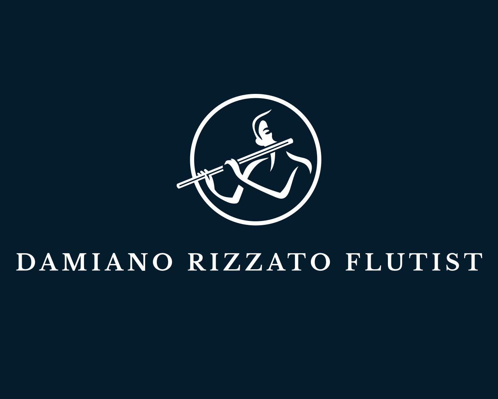

<h1>Damiano Rizzato - Flutist</h1>
Welcome to the official professional website of Damiano Rizzato, created to connect venues, artistic directors, classical music enthusiasts, and social media followers with Damiano.

This website serves as a landing page that allows various visitors to:

<ul>
<li>Discover more about his background and career;</li>
<li>Stay updated on his concerts and projects;</li>
<li>Listen to his recordings;</li>
<li>Contact him to discuss concert and project ideas or to book him for an event;</li>
</ul>
The primary business objective is to help the flutist secure more performance opportunities, emphasized by the prominent "Get in touch" button in the website's navigation bar.

<h2>Relevant User Stories</h2>
The foundation of this website is built on the following relevant user stories:

<ol>
<li>As an Instagram follower, I want to find a biography section, so I can learn more about Damiano's background.</li>
<li>As a regular concert attendee, I want to see a list of upcoming performances with clear details about time, date, venue, and program, so I can find events that interest me and fit my schedule.</li>
<li>As a classical music enthusiast, I want to subscribe to Damiano's newsletter, so I can receive updates on his upcoming performances, new recordings, and behind-the-scenes insights directly in my inbox.</li>
<li>As a classical music enthusiast, I want easy access to Damiano's social media profiles, so I can stay updated with his latest activities, performances, and content on various platforms.</li>
<li>As a concert venue, I want to listen to some of Damiano's recordings, so I can determine if he's a suitable fit for the concert I am organizing.</li>
<li>As an artistic director, I want to get in touch with Damiano, so I can discuss concert and project ideas with him.</li>
</ol>

<h2>Features</h2>

<h3>Navigation bar</h3>
<ul>
<li>The navigation bar is displayed on all five pages (homepage, concerts, recordings, get in touch and success pages), it's fully responsive and presents the logo (which enables navigation to the home page), all navigation links as well as two in-page links, namely Newsletter and About.</li>
<li>This section enables seamless navigation across all devices, allowing users to move from page to page without needing to use the 'back' button.</li>
</ul>

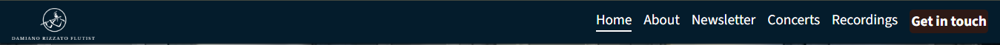

<h3>Footer</h3>
The footer section, which appears on all website pages and is fully responsive on all major screen sizes, comprises two key elements:
<ul>
<li><strong>the newsletter section:</strong> accessible from any page via an in-page link ("Newsletter") in the navbar, this section includes a short call to action and an email input field for users to sign up. Clicking on "sign up" will redirect the user to a feedback page, with a "Return to homepage" button.</li>

<!-- Add image feedback page newsletter-->

<li><strong>the social media section:</strong> this section includes links to all of the flutist's relevant social media sites. These links open in a new tab, ensuring easy navigation for the user.</li> 
</ul>
The footer section addresses the third and fourth user stories, enabling users to receive updates on upcoming concerts, projects, and recordings directly in their mailbox, as well as easily navigate to the flutist's various social media profiles to view the different types of content he publishes.

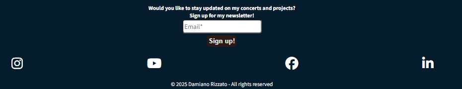

<h3>Landing page image</h3>
The landing includes a photograph of Damiano with text overlay with his full name.
This section introduces the user to the flutist with a photo from one of his performances.

<!-- Add photo landing page -->

<h3>About</h3>
The About section, located in the homepage directly under the hero-image, serves the user in that it directly addresses the first user story, providing them with the flutist's background information. This section is accessible from all pages by means of "About" nav link.

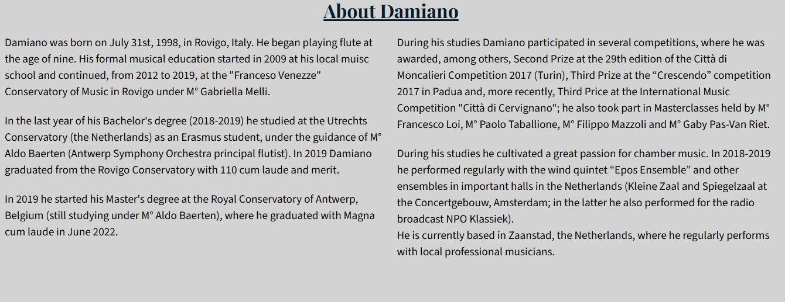

<h3>Concerts</h3>
The concerts page lists upcoming performances with details like venue, date, time, program, and other musicians. Each card consistst of two parts:
<ul>
<li>Venue picture, which if clicked links to the venue's homepage;</li>
<li>Concert description section, which includes the abovementioned information as well as a "Buy tickets" button that - currently - links to the venue's homepage. </li>
</ul> 
<strong>Note:</strong> dates, times, programs and the musicians' names are all fictional, therefore any reference to real people and events is purely coincidental. This section will be updated with real information in the future.

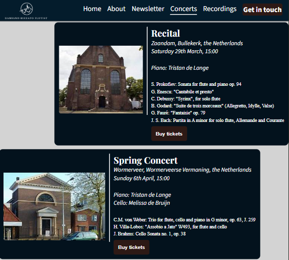

<h3>Recordings</h3>
The recordings page features four highlight recordings from Damiano's YouTube channel and a link to the full channel at the bottom. This section will regularly be updated with the flutist's latest recordings.
This feature addresses user story #5, providing artistic directors and venues the possibility to 

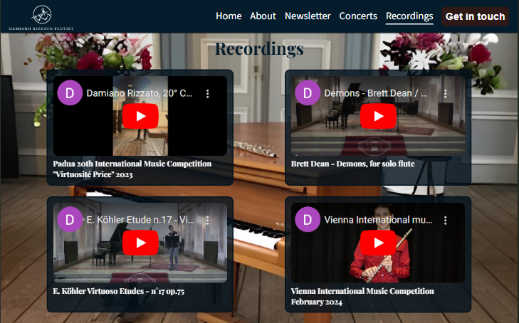

<h3>Get in touch</h3>
This page will allow primarily venues and artistic directors to get in touch with Damiano, in order to discuss concert and project ideas with him. This page consists of two elements:
<ul>
<li>a hero image with a text overlay</li>

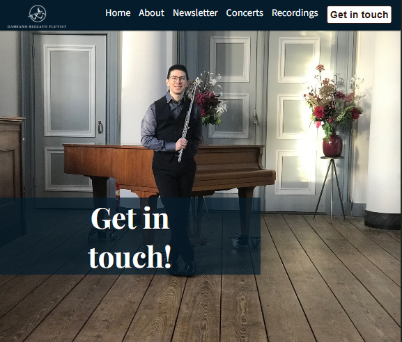

<li>the get-in-touch form, where the user will be able to specify the subject of their query/proposal and to type out their message in the textarea.

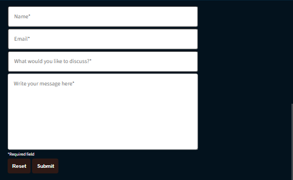

All the fields must be filled in, in order to meet the form submission requirements. After clicking on submit, the user will be redirected to a feedback page, which comprises a "Return to homepage button".
</li>

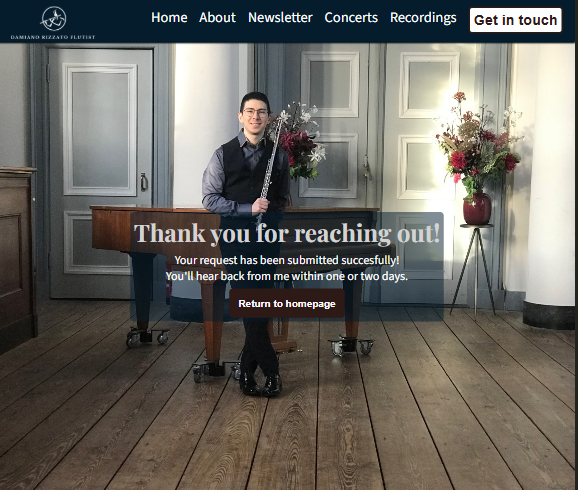
</ul>

<h2>Testing</h2>
<h3>Validator testing</h3>

<ul>
<li>HTML
<ul>
<li>Changed the h2 heading in the "About" section of index.html to h1, since it wasn't semantically right.</li>
<li>In recordings.html I removed the "frameboarder: 0" inline CSS style of the iframes and replaced it with external CSS</li>
<li>Added closing tags/Removed unnecessary opening tags</li>
<li>Substituted all the buttons nested inside anchor elements by using this code (See credits for the source)

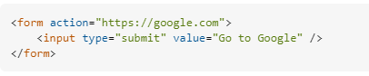

</li>
</ul>
</li>
<li>CSS</li>
</ul>

<h3>Lighthouse report</h3>

<!-- Add screenshot -->

<h3>Functional/Regression testing</h3>

<table>
<tr>
<th>Action</th>
<th>Expected behavior</th>
<th>Pass/Fail</th>
</tr>
<tr>
<td></td>
<td></td>
<td></td>
</tr>
<tr>
<td></td>
<td></td>
<td></td>
</tr>
</table>

<h3>Unfixed bugs</h3>
<h3>Deployment</h3>

The site was deployed to GitHub pages. 
The steps to deploy are as follows:
<ol>
<li>In the GitHub repository <em>Damiano-Rizzato-Flutist---Project-1-HTML-CSS</em>, navigate to the Settings tab</li>
<li>From the source section drop-down menu, select the Master Branch</li>
<li>Once the master branch has been selected, the page will be automatically refreshed with a detailed ribbon display to indicate the successful deployment.</li>
</ol>

<h2>Credits</h2>

<h3>Content</h3>

<ul>
<li>Solution for fixing the a>button error the HTML Validator was pointing out was taken from <a href="https://stackoverflow.com/questions/2906582/how-do-i-create-an-html-button-that-acts-like-a-link" target="_blank">Stackoverflow</a></li>
<li>Code for making the "Buy tickets" links in the concerts.html page look like buttons while still opening on a new tab was taken from Microsoft-copilot, search query: "How to turn a link into a button?"</li>

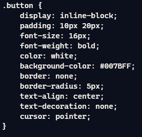

<li>Code for structure navbar, nav-toggle, structure footer, position of hero-image and text overlay in the homepage was taken from the Love Running CI project</li>
</ul>

<h4>Technologies used</h4>
<ul>
<li>The logo was made using <a href="https://www.design.com/identity/account/signin?returnUrl=%2Fmaker%2Fmylogos%2Fdrafts%2F1a12edad-ae26-4e4e-ac1b-dafe6d2c9723%2Fdownload" target="_blank" aria-label="Sign in page Design.com">www.design.com</a></li>
<li>The favicons were made using <a href="https://favicon.io/" target="_blank" aria-label="Favicon.io homepage">favicon.io</a></li>
<li>The social media icons were taken from <a href="https://fontawesome.com/" target="_blank" aria-label="Fontawesome homepage">www.fontawesome.com</a></li>
<li>The musicians' names (Tristan de Lange and Melissa de Bruijn) were generated by <a href="https://www.random-name-generator.com/netherlands?s=965&search_terms=&gender=female&search_terms=&n=3" target="_blank" aria-label="Random name generator - Dutch names page">www.random-name-generator.com</a></li>
<li>HTML for the website structure</li>
<li>CSS for the website layout and esthetic</li>
</ul>

<h4>Media</h4>
<ul>
<li>The pictures used in the following pages were taken by <strong>Tom Tulleken</strong>:
<ul>
<li>Homepage</li>
<li>Get in touch page</li>
<li>Feedback page after Get in touch form submission</li>
<li>Feedback page after signing up for the Newsletter</li>
</ul>
</li>
<li>The venue pictures used in the Concerts page were taken from <a href="https://images.google.com/" target="_blank" aria-label="Google images">images.google.com</a></li>
<li>All the YouTube videos included in the Recordings page were taken from my own <a href="https://www.youtube.com/@dam987" target="_blank" aria-label="Damiano Rizzato flutist - YouTube profile">YouTube channel</a></li>
</ul>
