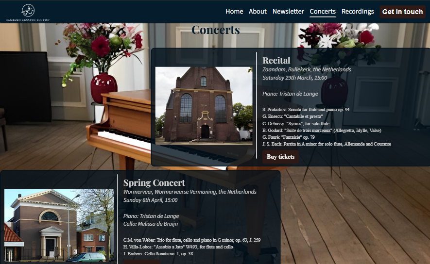
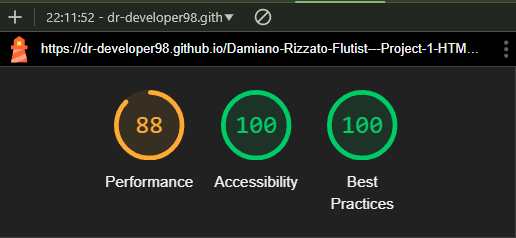

<h1>Damiano Rizzato - Flutist</h1>
Welcome to the official professional website of Damiano Rizzato, created to connect venues, artistic directors, classical music enthusiasts, and social media followers with Damiano.

This website serves as a landing page that allows various visitors, most likely adults, located in the Zaanstad area in the Netherlands, to:

<ul>
<li>Discover more about his background and career;</li>
<li>Stay updated on his concerts and projects;</li>
<li>Listen to his recordings;</li>
<li>Contact him to discuss concert and project ideas or to book him for an event;</li>
</ul>
The primary business objective is to help the flutist secure more performance opportunities, emphasized by the prominent "Get in touch" button in the website's navigation bar.

<h2>Relevant User Stories</h2>
The foundation of this website is built on the following user stories:

<ol>
<li>As an Instagram follower, I want to find a biography section, so I can learn more about Damiano's background.</li>
<li>As a regular concert attendee, I want to see a list of upcoming performances with clear details about time, date, venue, and program, so I can find events that interest me and fit my schedule.</li>
<li>As a classical music enthusiast, I want to subscribe to Damiano's newsletter, so I can receive updates on his upcoming performances, new recordings, and behind-the-scenes insights directly in my inbox.</li>
<li>As a classical music enthusiast, I want easy access to Damiano's social media profiles, so I can stay updated with his latest activities, performances, and content on various platforms.</li>
<li>As the manager of a concert venue, I want to listen to some of Damiano's recordings, so I can determine if he's a good fit for the concert I am organizing.</li>
<li>As an artistic director, I want to get in touch with Damiano, so I can discuss concert and project ideas with him.</li>
</ol>

<h2>Features</h2>

<h3>Navigation bar</h3>
<ul>
<li>The navigation bar is displayed on all five pages (homepage, concerts, recordings, get in touch and success pages), it's fully responsive and presents the logo (which enables navigation to the home page), all navigation links as well as two in-page links, namely Newsletter and About.</li>
<li>This section enables seamless navigation across all devices, allowing users to move from page to page without needing to use the 'back' button.</li>
</ul>

<h3>Footer</h3>
The footer section, which appears on all website pages and is fully responsive on all major screen sizes, comprises two key elements:
<ul>
<li><strong>the newsletter section:</strong> accessible from any page via an in-page link ("Newsletter") in the navbar, this section includes a short call to action and an email input field for users to sign up. Clicking on "sign up" will redirect the user to a feedback page, with a short thank-you-for-signing-up text as well as a "Return to homepage" button.
 
<strong style="color: red">Note:</strong> on many websites, the feedback given to the users upon signing up for a newsletter is a strip of text appearing below the email input field. As this requires JavaScript and as I didn't possess the right set of skills at the time of me designing this website, I chose to create a whole feedback page</li>

<li><strong>the social media section:</strong> this section includes links to all of the flutist's relevant social media sites. These links open in a new tab, ensuring easy navigation for the user.</li> 
</ul>
The footer section addresses the third and fourth user stories, enabling users to receive updates on upcoming concerts, projects, and recordings directly in their mailbox, as well as easily navigate to the flutist's various social media profiles to view the different types of content he publishes.

<h3>Landing page image</h3>
The landing includes a photograph of Damiano with text overlay with his full name.
This section introduces the user to the flutist with a photo from one of his performances.

<h3>About</h3>
The About section, located in the homepage directly under the hero-image, serves the user in that it directly addresses the first user story, providing them with the flutist's background information. This section is accessible from all pages by means of "About" nav link.

<h3>Concerts</h3>
The concerts page lists upcoming performances with details like venue, date, time, program, and collaborators' names. Each card consists of two parts:
<ul>
<li>Venue picture, which upon clicking will redirect the user to the venue's homepage;</li>
<li>Concert description section, which includes all useful information as well as a "Buy tickets" button that - currently - links to the venue's homepage. </li>
</ul> 
<strong style="color: red">Note:</strong> dates, times, programs and the musicians' names are all fictional, therefore any reference to real people and events is purely coincidental. This section will be updated with real events in the future.

<h3>Recordings</h3>
The recordings page features eight highlight recordings from Damiano's YouTube channel and a link to the full channel at the bottom. This section will regularly be updated with the flutist's latest recordings.
This feature addresses user story #5, providing artistic directors and venues the possibility to easily access and review the latest performances and works by Damiano, helping them make informed decisions regarding potential bookings and collaborations. 

<h3>Get in touch</h3>
This page will allow primarily concert venue managers and artistic directors to get in touch with Damiano, in order to discuss concert and project ideas with him. This page consists of two elements:
<ul>
<li><strong>a hero image with a text overlay</strong></li>

<li><strong>the get-in-touch form</strong>, where the user will be able to specify the subject of their query/proposal and to type out their message in the textarea.

All the fields must be filled in, in order to meet the form submission requirements. After clicking on submit, the user will be redirected to a feedback page, which comprises a short thank-you-for-reaching-out text as well as a "Return to homepage" button.
</li>

</ul>

<h2>Testing</h2>
I tested that this website works across some of the major Browsers: Google Chrome, Mozilla Firefox and Microsoft Edge.
I also ran manual tests on the following devices and the website worked on all of them as expected.
<ul>
<li><strong>Mobile phones:</strong> Samsung A52, Iphone 7 Plus;</li>
<li><strong>Tablet:</strong> Galaxy Tab A (2016)</li>
<li><strong>Laptop:</strong> Lenovo </li>
</ul>
For responsiveness and tests on devices larger than the ones mentioned above I used the Browser Dev Tools.

<h3 style="color: darkred">Validator testing</h3>

<h4 style="color: orange">HTML</h4>

The website HTML was tested using <a href="https://validator.w3.org/" target="_blank">W3C validator</a>

<h5>1) Fixed bugs</h5>

<ul>
<li>In recordings.html I removed the "frameboarder: 0" inline CSS style of the iframes and replaced it with external CSS "border: none." <strong style="color: green">Credit:</strong> <a href="https://www.w3schools.com/tags/tryit.asp?filename=tryhtml_iframe_frameborder_css" target="_blank">W3School</a></li>
<li>Added closing tags/Removed unnecessary opening tags</li>
<li>Substituted the button mistakingly nested inside an anchor element (Get-in-touch button in navbar) by using the code hereinafter.
<strong style="color: green">Credit:</strong> <a href="https://stackoverflow.com/questions/2906582/how-do-i-create-an-html-button-that-acts-like-a-link" target="_blank">Stackoverflow</a></li>

<li>Since the abovementioned code doesn't allow to create buttons that open on a new tab, in order to make the "Buy tickets" buttons for the concerts page and the "Return to homepage" buttons on the feedback pages, this code ↓ was used.
 
<strong style="color: green">Credit:</strong> <a href="https://www.w3schools.com/css/tryit.asp?filename=trycss_link_advanced" target="_blank">W3School</a>
</li>

<li>In concerts.html, in the .concert-text section of each concert card, the Validator was giving this error message: "Error: No p element in scope but a p end tag seen.". This was caused by the paragraphs incorrectly cointaining the block-level element "ul". This was fixed by removing the paragraphs as containers of those unordered lists. <strong style="color: green">Credit:</strong> <a href="https://github.com/validator/validator/issues/1101">github.com/validator/validator/issues/1101</a></li>

<li>In get-in-touch.html, the #form section was lacking a heading. This was solved by turning the section #form element into a div#form element and by removing the unnecessary direct div-child.</li>

<li>With regard to the confirmation pages for the get in touch form and the newsletter signup section no errors were returned when passing through the official Validator.</li>
</ul>

<h5>2) HTML Validator results</h5>
<ul>
<li>Homepage/index.html</li>

<li>Concerts page</li>

<li>Recordings page</li>

<li>Get in touch page</li>

<li>Feedback page Get in touch form</li>

<li>Feedback page Newsletter signup form</li>

</ul>

<h4 style="color: orange">CSS</h4>

The Website CSS was tested using the official <a href="https://jigsaw.w3.org/css-validator/" target="_blank">CSS Validation Service</a>

<h5>1) Fixed bugs</h5>
<ul>
<li>Removed padding-bottom: -10px from #newsletter section in footer, since negative padding values aren't allowed.</li></ul>

<h5>2) CSS Validator result</h5>
<ul>
<li>Total validation</li>

</ul>

<h3>Lighthouse report</h3>

<h4>1) Fixed bugs</h4>
<ul>
<li>Added "link rel="preload" as="image" href="path-to-your-image.jpg"" to "head" element of all pages in order to improve the LCP. Integrating this pushed lighthouse performacen rate. 
<strong style="color: green">Credit: </strong><a href="https://speedvitals.com/blog/preload-lcp-image/" target="_blank">speedvitals.com</a></li>
<li>Added width: 120px to logo in the navbar to improve Lighthouse performance score.</li>
</ul>

<h4>2) Lighthouse score</h4>

<h3>Manual testing</h3>

<table>
<tr>
<th>Action</th>
<th>Expected behavior</th>
<th>Pass/Fail</th>
</tr>
<tr>
<td>Visit <a href="https://dr-developer98.github.io/Damiano-Rizzato-Flutist---Project-1-HTML-CSS/">Damiano Rizzato - Flutist</a></td>
<td>Land on hero-image section in the homepage</td>
<td>Pass</td>
</tr>
<tr>
<td>NAVIGATION MENU ON MOBILE PHONES</td>
<td>-</td>
<td>-</td>
</tr>
<tr>
<td>Click on the burger icon from the Homepage, Recordings, Concerts, Get in touch, Feedback get in touch and Feedback newsletter</td>
<td>Display whole Menu with all navlinks stacked on top of each other</td>
<td>Pass</td>
</tr>
<tr>
<td>Click on the burger icon with the menu fully displayed from Homepage, Recordings, Concerts, Get in touch, Feedback get in touch and Feedback newsletter</td>
<td>Collapse the dropdown menu</td>
<td>Pass</td>
</tr>
<tr>
<td><strong>HOMEPAGE</strong></td>
<td>-</td>
<td>-</td>
</tr>
<tr>
<td>Hover over "Home" navlink</td>
<td>Slim down the Home underlining</td>
<td>Pass</td>
</tr>
<tr>
<td>Click on "Home" in the navbar</td>
<td>Rerender the page</td>
<td>Pass</td>
</tr>
<tr>
<td>Click on the Logo</td>
<td>Rerender the page and land on hero-image section</td>
<td>Pass</td>
</tr>
<tr>
<td>Hover over "About", "Newsletter", "Concerts", "Recordings"</td>
<td>A white underlining appears under the hovered over navlink</td>
<td>Pass</td>
</tr>
<tr>
<td>Hover over "Get in touch" button</td>
<td>Maintain button brown borders, change background-color to white and text-color to brown</td>
<td>Pass</td>
</tr>
<tr>
<td>Click on "About" navlink</td>
<td>Move user to About section in the homepage</td>
<td>Pass</td>
</tr>
<tr>
<td>Click on "Newsletter" navlink</td>
<td>Move user to footer/newsletter section while staying in the homepage</td>
<td>Pass</td>
</tr>
<tr>
<td>While in the About section, click on Logo</td>
<td>Rerender the homepage and land on hero-image section</td>
<td>Pass</td>
</tr>
<tr>
<td>Click on "Concerts" navlink</td>
<td>Redirect to Concerts page</td>
<td>Pass</td>
</tr>
<tr>
<td>Click on "Recordings" navlink</td>
<td>Redirect to Recordings page</td>
<td>Pass</td>
</tr>
<tr>
<td>Click on "Get in touch" button in navbar</td>
<td>Redirect to Get in touch page</td>
<td>Pass</td>
</tr>
<tr>
<td><strong>CONCERTS PAGE</strong></td>
<td>-</td>
<td>-</td>
</tr>
<tr>
<td>Hover over "Concerts" navlink</td>
<td>Slim down the "Concerts" underlining</td>
<td>Pass</td>
</tr>
<tr>
<td>Hover over "Home", "About", "Newsletter", "Recordings"</td>
<td>A white underlining appears under the hovered over navlink</td>
<td>Pass</td>
</tr>
<tr>
<td>Hover over "Get in touch" button</td>
<td>Maintain button brown borders, change background-color to white and text-color to brown</td>
<td>Pass</td>
</tr>
<tr>
<td>Click on Home</td>
<td>Redirect to homepage</td>
<td>Pass</td>
</tr>
<tr>
<td>Click on Logo</td>
<td>Redirect to homepage</td>
<td>Pass</td>
</tr>
<tr>
<td>Click on "About" navlink</td>
<td>Redirect to About section in home page</td>
<td>Pass</td>
</tr>
<tr>
<td>Click on "Concerts" navlink</td>
<td>Rerender Concerts page</td>
<td>Pass</td>
</tr>
<tr>
<td>Click on "Recordings" navlink</td>
<td>Redirect to Recordings page</td>
<td>Pass</td>
</tr>
<tr>
<td>Click on "Get in touch" button</td>
<td>Redirect to Get in touch page</td>
<td>Pass</td>
</tr>
<tr>
<td>Click on any venue image</td>
<td>Open venue website in a new tab</td>
<td>Pass</td>
</tr>
<tr>
<td>Hover over any "Buy tickets" button</td>
<td>Change button background-color to brown, text-color to white, while preserving brown border</td>
<td>Pass</td>
</tr>
<tr>
<td>Click on any "Buy tickets" button</td>
<td>Open venue website in a new tab</td>
<td>Pass</td>
</tr>
<tr>
<td>Click on "Newsletter" navlink</td>
<td>Move to footer newsletter section while staying on Concerts page</td>
<td>Pass</td>
</tr>
<tr>
<td><strong>RECORDINGS PAGE</strong></td>
<td>-</td>
<td>-</td>
</tr>
<tr>
<td>Hover over "Recordings" navlink</td>
<td>Slim down the "Recordings" underlining</td>
<td>Pass</td>
</tr>
<tr>
<td>Hover over "Home", "About", "Newsletter", "Concerts"</td>
<td>A white underlining appears under the hovered over navlink</td>
<td>Pass</td>
</tr>
<tr>
<td>Hover over "Get in touch" button</td>
<td>Maintain button brown borders, change background-color to white and text-color to brown</td>
<td>Pass</td>
</tr>
<tr>
<td>Click on Logo in the navbar</td>
<td>Redirect to homepage at the level of hero-image</td>
<td>Pass</td>
</tr>
<tr>
<td>Click on "Home" in the navbar</td>
<td>Redirect to homepage at the level of hero-image</td>
<td>Pass</td>
</tr>
<tr>
<td>Click on "About" in the navbar</td>
<td>Redirect to About section in homepage</td>
<td>Pass</td>
</tr>
<tr>
<td>Click on "Concerts" navlink</td>
<td>Redirect to Concerts page</td>
<td>Pass</td>
</tr>
<tr>
<td>Click on "Newsletter" navlink</td>
<td>Move user to the footer newsletter signup section while staying on Recordings page</td>
<td>Pass</td>
</tr>
<tr>
<td>Click on "Recordings" navlink</td>
<td>Rerender Recordings page</td>
<td>Pass</td>
</tr>
<tr>
<td>Click on "Get in touch" button</td>
<td>Redirect to Get in touch page</td>
<td>Pass</td>
</tr>
<tr>
<td>Hover over interactive words "YouTube channel" in the call-to-action paragraph under the video list</td>
<td>Change words color to brown</td>
<td>Pass</td>
</tr>
<tr>
<td>Click on interactive words "YouTube channel" at the bottom of the page</td>
<td>Open Damiano's YouTube channel in a new tab</td>
<td>Pass</td>
</tr>
<tr>
<td>Click on any video</td>
<td>Start playing video and provide user control bar (pause, volumen, progress-bar)</td>
<td>Pass</td>
</tr>
<tr>
<td>GET IN TOUCH PAGE</td>
<td>-</td>
<td>-</td>
</tr>
<tr>
<td>Hover over "Get in touch" button</td>
<td>Button maintains brown borders, white background-color, brown text-color</td>
<td>Pass</td>
</tr>
<tr>
<td>Hover over "Home", "About", "Newsletter", "Concerts" and "Recordings"</td>
<td>A white underlining appears under the hovered over navlink</td>
<td>Pass</td>
</tr>
<tr>
<td>Click on Logo in the navbar</td>
<td>Redirect to homepage at the level of hero-image</td>
<td>Pass</td>
</tr>
<tr>
<td>Click on "Home" navlink</td>
<td>Redirect to homepage at the level of hero-image</td>
<td>Pass</td>
</tr>
<tr>
<td>Click on "About" navlink</td>
<td>Redirect to About section in the homepage</td>
<td>Pass</td>
</tr>
<tr>
<td>Click on "Newsletter" navlink</td>
<td>Move to footer newsletter signup form, while staying in Get in touch page</td>
<td>Pass</td>
</tr>
<tr>
<td>Click on "Concerts" navlink</td>
<td>Redirect to Concerts page</td>
<td>Pass</td>
</tr>
<tr>
<td>Click on "Recordings" navlink</td>
<td>Redirect to Recordings page</td>
<td>Pass</td>
</tr>
<tr>
<td>Hover over "Get in touch" button</td>
<td>Button maintains brown border, white background and brown text-color</td>
<td>Pass</td>
</tr>
<tr>
<td>Click on "Get in touch" button</td>
<td>Rerender Get in touch page</td>
<td>Pass</td>
</tr>
<tr>
<td><strong>GET IN TOUCH form</strong></td>
<td>-</td>
<td>-</td>
</tr>
<tr>
<td>Click on Submit without filling in any field</td>
<td>Prompt to fill in a Name</td>
<td>Pass</td>
</tr>
<tr>
<td>Fill in Name and click on Submit</td>
<td>Prompt to fill in an Email address</td>
<td>Pass</td>
</tr>
<tr>
<td>Fill in Name and Email and click on Submit</td>
<td>Prompt to fill in a Subject</td>
<td>Pass</td>
</tr>
<tr>
<td>Fill in Name, Email and Subject and click on Submit</td>
<td>Prompt to fill in a message in the textarea</td>
<td>Pass</td>
</tr>
<tr>
<td>Fill in all form fields and click on Submit</td>
<td>Redirect to feedback page for the Get in touch form</td>
<td>Pass</td>
</tr>
<tr>
<td>Fill in some/all fields and click on Reset</td>
<td>Clear all filled in fields</td>
<td>Pass</td>
</tr>
<tr>
<td><strong>FEEDBACK PAGE GET IN TOUCH FORM</strong></td>
<td>-</td>
<td>-</td>
</tr>
<tr>
<td>Hover over "Home", "About", "Newsletter", "Concerts", "Recordings"</td>
<td>A white underlining appears under the hovered over navlink</td>
<td>Pass</td>
</tr>
<tr>
<td>Hover over "Return to homepage" button</td>
<td>Keep brown border button, change background-color to white and text-color to brown</td>
<td>Pass</td>
</tr>
<tr>
<td>Click on "Return to homepage" button</td>
<td>Redirect to homepage</td>
<td>Pass</td>
</tr>
<tr>
<td>Click on Logo in navbar</td>
<td>Redirect to homepage, hero-image section</td>
<td>Pass</td>
</tr>
<tr>
<td>Click on "Home" navlink</td>
<td>Redirect to homepage, hero-image section</td>
<td>Pass</td>
</tr>
<tr>
<td>Click on "About" navlink</td>
<td>Redirect to About section in homepage</td>
<td>Pass</td>
</tr>
<tr>
<td>Click on "Newsletter" navlink</td>
<td>Move to footer newsletter sign up form, while staying on the Feedback get-in-touch page</td>
<td>Pass</td>
</tr>
<tr>
<td>Click on "Concerts" navlink</td>
<td>Redirect to Concerts page</td>
<td>Pass</td>
</tr>
<tr>
<td>Click on "Recordings" navlink</td>
<td>Redirect to Recordings page</td>
<td>Pass</td>
</tr>
<tr>
<td>Hover over "Get in touch" button</td>
<td>Button maintains brown borders, white background and brown text</td>
<td>Pass</td>
</tr>
<tr>
<td>Click on "Get in touch" button</td>
<td>Redirect to Get in touch page</td>
<td>Pass</td>
</tr>
<tr>
<td><strong>NEWSLETTER signup form</strong></td>
<td>-</td>
<td>-</td>
</tr>
<tr>
<td>Click on "Sign up" without inputting text</td>
<td>Prompt to fill in a value with the @ (at) symbol</td>
<td>Pass</td>
</tr>
<tr>
<td>Fill in an e-mail address/text with the @ (at) symbol and click on "Sign up"</td>
<td>Redirect to Feedback page Newsletter</td>
<td>Pass</td>
</tr>
<tr>
<td><strong>FEEDBACK PAGE NEWSLETTER</strong></td>
<td>-</td>
<td>-</td>
</tr>
<tr>
<td>Hover over "Home", "About", "Newsletter", "Concerts", "Recordings"</td>
<td>A white underlining appears under the hovered over navlink</td>
<td>Pass</td>
</tr>
<tr>
<td>Hover over "Get in touch" button</td>
<td>Maintain button brown borders, change background-color to white and text-color to brown</td>
<td>Pass</td>
</tr>
<tr>
<td>Hover over "Return to homepage" button</td>
<td>Maintain button brown borders, change background-color to white and text-color to brown</td>
<td>Pass</td>
</tr>
<tr>
<td>Click on "Return to homepage" button</td>
<td>Redirect to homepage</td>
<td>Pass</td>
</tr>
<td>Click on Logo in navbar</td>
<td>Redirect to homepage, hero-image section</td>
<td>Pass</td>
</tr>
<tr>
<td>Click on "Home" navlink</td>
<td>Redirect to homepage, hero-image section</td>
<td>Pass</td>
</tr>
<tr>
<td>Click on "About" navlink</td>
<td>Redirect to About section in homepage</td>
<td>Pass</td>
</tr>
<tr>
<td>Click on "Newsletter" navlink</td>
<td>Move to footer newsletter sign up form, while staying on the Feedback newsletter page</td>
<td>Pass</td>
</tr>
<tr>
<td>Click on "Concerts" navlink</td>
<td>Redirect to Concerts page</td>
<td>Pass</td>
</tr>
<tr>
<td>Click on "Recordings" navlink</td>
<td>Redirect to Recordings page</td>
<td>Pass</td>
</tr>
<tr>
<td>Click on "Get in touch" button</td>
<td>Redirect to Get in touch page</td>
<td>Pass</td>
</tr>
<tr>
<td><strong>FOOTER SOCIAL MEDIA ICONS ON ALL PAGES</strong></td>
<td>-</td>
<td>-</td>
</tr>
<tr>
<td>Hover over any social media icon</td>
<td>The URL of the corresponding social media network appears in the bottom left corne of the page</td>
<td>Pass</td>
</tr>
<tr>
<td>Click on any social media icon</td>
<td>Open login page of the selected social media network</td>
<td>Pass</td>
</tr>
</table>

<h3>Fixed bugs</h3>
<ul>
<li>In the navbar the navlinks and the get in touch button weren't aligned. 
This was fixed by adding some padding-top to the links and by overriding this property for the get in touch button by using the pseudo class selector nav li:last-child. 
<strong style="color: green">Credit: </strong><a href="https://developer.mozilla.org/en-US/docs/Web/CSS/:last-child" target="_blank">developer.mozilla.org</a></li>
<li>The main heading in the recordings page wasn't the same size as the one in the concerts page, despite having set the same stle rule for it. This was fixed by changing the relationship #recordings>h1 (parent-child) to #recordings h1 (ancestor-descendant).</li>
<li>In the recordings page, the link to the YouTube channel in the call-to-action paragraph at the bottom of the page wasn't changing color when :hover nor when :visited. This was due to the relevant pseudo-classes not being in the right order. This was fixed by applying the LoVe HaTe mnemonic:
 
L: a:link - Default state of the link.

V: a:visited - After the link has been clicked.

H: a:hover - When the user hovers over the link.

A: a:active - When the link is being clicked.
 
<strong style="color: green">Credit:</strong> <a href="https://css-tricks.com/snippets/css/link-pseudo-classes-in-order/" target="_blank">css-tricks.com</a></li>
</ul>

<h3>Unfixed bugs</h3>
<ul>
<li>On mobile phones the menu doesn't automatically collapse when clicking on a inpage link. This means that pressing/clicking on "Newsletter" on any page will direct the user to the footer, but the menu won't collapse. The same applies to "About" in the homepage. 
This can be fixed by using JavaScript, which falls outside of the scope of this project.</li>
</ul>

<h3>Deployment</h3>

The site was deployed to GitHub pages. 
The steps to deploy are as follows:
<ol>
<li>Navigate to the GitHub Repository;</li>
<li>Click on the "Settings" tab on the top navigation bar;</li>
<li>Click on "Pages" on the left navigation menu";</li>
<li>Ensure the "Source" is set to "Deploy from a Branch";</li>
<li>Ensure the "Branch" is set to "Main"</li>
<li>Click on "Save";</li>
<li>The page will be automatically refreshed with a detailed ribbon display to indicate the successful deployment.</li>
</ol>

Here is the link to the deployed version: <a href="https://dr-developer98.github.io/Damiano-Rizzato-Flutist---Project-1-HTML-CSS/" target="blank">Damiano Rizzato - Flutist</a>

<h2>Credits</h2>

<h3>Content</h3>

<ul>
<li>Code for structure navbar, nav-toggle, structure footer, position of hero-image and text overlay in the homepage was taken from the Love Running CI project. For detailed source referencing, please refer to <a href="index.html">index.html</a> and <a href="assets/css/style.css">style.css</a>.</li>
<li>Cursor: pointer property added to website buttons was taken from <a href="https://www.w3schools.com/cssref/pr_class_cursor.php">W3School</a>.</li>
</ul>

<h4>Technologies used</h4>
<ul>
<li>The logo was made using <a href="https://www.design.com/identity/account/signin?returnUrl=%2Fmaker%2Fmylogos%2Fdrafts%2F1a12edad-ae26-4e4e-ac1b-dafe6d2c9723%2Fdownload" target="_blank" aria-label="Sign in page Design.com">www.design.com</a>.</li>
<li>The favicons were made using <a href="https://favicon.io/" target="_blank" aria-label="Favicon.io homepage">favicon.io</a></li>
<li>The social media icons for the footer and the burger icon for the dropdown menu were taken from <a href="https://fontawesome.com/" target="_blank" aria-label="Fontawesome homepage">www.fontawesome.com</a>.</li>
<li>The musicians' names (Tristan de Lange and Melissa de Bruijn) were generated by <a href="https://www.random-name-generator.com/netherlands?s=965&search_terms=&gender=female&search_terms=&n=3" target="_blank" aria-label="Random name generator - Dutch names page">www.random-name-generator.com</a>.</li>
<li>The used pictures were upscaled using <a href="https://www.iloveimg.com/upscale-image" target="_blank">www.iloveimg.com</a>.</li>
<li>HTML for website structure and different pages.</li>
<li>CSS for website styling.</li>
</ul>

<h4>Media</h4>
<ul>
<li>The pictures used in the following pages were taken by <strong>Tom Tulleken</strong>:
<ul>
<li>Homepage</li>
<li>Get in touch page</li>
<li>Feedback page after Get in touch form submission</li>
<li>Feedback page after signing up for the Newsletter</li>
<li>Recordings page</li>
<li>Concerts page (background-image)</li>
</ul>
</li>
<li>The venue pictures used in the Concerts page were taken from <a href="https://images.google.com/" target="_blank" aria-label="Google images">images.google.com</a></li>
<li>All the YouTube videos included in the Recordings page were taken from my own <a href="https://www.youtube.com/@dam987" target="_blank" aria-label="Damiano Rizzato flutist - YouTube profile">YouTube channel</a>.</li>
</ul>
