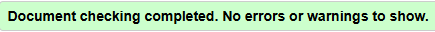
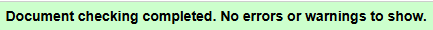
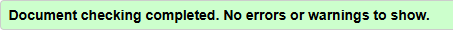
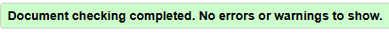
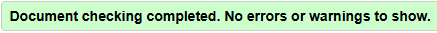
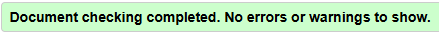
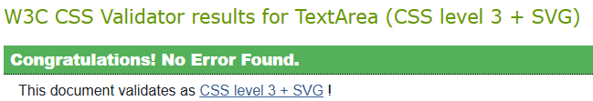
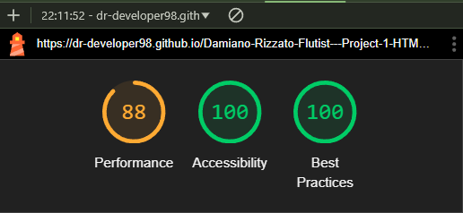

<h1>TESTING</h1>

I tested that this website works across some of the major Browsers: Google Chrome, Mozilla Firefox and Microsoft Edge.
I also ran manual tests on the following devices and the website worked on all of them as expected.
<ul>
<li><strong>Mobile phones:</strong> Samsung A52, Iphone 7 Plus;</li>
<li><strong>Tablet:</strong> Galaxy Tab A (2016)</li>
<li><strong>Laptop:</strong> Lenovo </li>
</ul>
For responsiveness and tests on devices larger than the ones mentioned above I used the Browser Dev Tools.

<h3 style="color: darkred">Validator testing</h3>

<h4 style="color: orange">HTML</h4>

The website HTML was tested using <a href="https://validator.w3.org/" target="_blank">W3C validator</a>

<h5>1) Fixed bugs</h5>

<ul>
<li>In recordings.html I removed the "frameboarder: 0" inline CSS style of the iframes and replaced it with external CSS "border: none." <strong style="color: green">Credit:</strong> <a href="https://www.w3schools.com/tags/tryit.asp?filename=tryhtml_iframe_frameborder_css" target="_blank">W3School</a></li>
<li>Added closing tags/Removed unnecessary opening tags</li>
<li>Substituted the button mistakingly nested inside an anchor element (Get-in-touch button in navbar) by using the code hereinafter.
<strong style="color: green">Credit:</strong> <a href="https://stackoverflow.com/questions/2906582/how-do-i-create-an-html-button-that-acts-like-a-link" target="_blank">Stackoverflow</a></li>

<li>Since the abovementioned code doesn't allow to create buttons that open on a new tab, in order to make the "Buy tickets" buttons for the concerts page and the "Return to homepage" buttons on the feedback pages, this code ↓ was used.
 
<strong style="color: green">Credit:</strong> <a href="https://www.w3schools.com/css/tryit.asp?filename=trycss_link_advanced" target="_blank">W3School</a>
</li>

<li>In concerts.html, in the .concert-text section of each concert card, the Validator was giving this error message: "Error: No p element in scope but a p end tag seen.". This was caused by the paragraphs incorrectly cointaining the block-level element "ul". This was fixed by removing the paragraphs as containers of those unordered lists. <strong style="color: green">Credit:</strong> <a href="https://github.com/validator/validator/issues/1101">github.com/validator/validator/issues/1101</a></li>

<li>In get-in-touch.html, the #form section was lacking a heading. This was solved by turning the section #form element into a div#form element and by removing the unnecessary direct div-child.</li>

<li>With regard to the confirmation pages for the get in touch form and the newsletter signup section no errors were returned when passing through the official Validator.</li>
</ul>

<h5>2) HTML Validator results</h5>
<ul>
<li>Homepage/index.html</li>

<li>Concerts page</li>

<li>Recordings page</li>

<li>Get in touch page</li>

<li>Feedback page Get in touch form</li>

<li>Feedback page Newsletter signup form</li>

</ul>

<h4 style="color: orange">CSS</h4>

The Website CSS was tested using the official <a href="https://jigsaw.w3.org/css-validator/" target="_blank">CSS Validation Service</a>

<h5>1) Fixed bugs</h5>
<ul>
<li>Removed padding-bottom: -10px from #newsletter section in footer, since negative padding values aren't allowed.</li></ul>

<h5>2) CSS Validator result</h5>
<ul>
<li>Total validation</li>

</ul>

<h3>Lighthouse report</h3>

<h4>1) Fixed bugs</h4>
<ul>
<li>Added "link rel="preload" as="image" href="path-to-your-image.jpg"" to "head" element of all pages in order to improve the LCP. Integrating this pushed lighthouse performacen rate. 
<strong style="color: green">Credit: </strong><a href="https://speedvitals.com/blog/preload-lcp-image/" target="_blank">speedvitals.com</a></li>
<li>Added width: 120px to logo in the navbar to improve Lighthouse performance score.</li>
</ul>

<h4>2) Lighthouse score</h4>

<h3>Manual testing</h3>

<table>
<tr>
<th>Action</th>
<th>Expected behavior</th>
<th>Pass/Fail</th>
</tr>
<tr>
<td>Visit <a href="https://dr-developer98.github.io/Damiano-Rizzato-Flutist---Project-1-HTML-CSS/">Damiano Rizzato - Flutist</a></td>
<td>Land on hero-image section in the homepage</td>
<td>Pass</td>
</tr>
<tr>
<td>NAVIGATION MENU ON MOBILE PHONES</td>
<td>-</td>
<td>-</td>
</tr>
<tr>
<td>Click on the burger icon from the Homepage, Recordings, Concerts, Get in touch, Feedback get in touch and Feedback newsletter</td>
<td>Display whole Menu with all navlinks stacked on top of each other</td>
<td>Pass</td>
</tr>
<tr>
<td>Click on the burger icon with the menu fully displayed from Homepage, Recordings, Concerts, Get in touch, Feedback get in touch and Feedback newsletter</td>
<td>Collapse the dropdown menu</td>
<td>Pass</td>
</tr>
<tr>
<td><strong>HOMEPAGE</strong></td>
<td>-</td>
<td>-</td>
</tr>
<tr>
<td>Hover over "Home" navlink</td>
<td>Slim down the Home underlining</td>
<td>Pass</td>
</tr>
<tr>
<td>Click on "Home" in the navbar</td>
<td>Rerender the page</td>
<td>Pass</td>
</tr>
<tr>
<td>Click on the Logo</td>
<td>Rerender the page and land on hero-image section</td>
<td>Pass</td>
</tr>
<tr>
<td>Hover over "About", "Newsletter", "Concerts", "Recordings"</td>
<td>A white underlining appears under the hovered over navlink</td>
<td>Pass</td>
</tr>
<tr>
<td>Hover over "Get in touch" button</td>
<td>Maintain button brown borders, change background-color to white and text-color to brown</td>
<td>Pass</td>
</tr>
<tr>
<td>Click on "About" navlink</td>
<td>Move user to About section in the homepage</td>
<td>Pass</td>
</tr>
<tr>
<td>Click on "Newsletter" navlink</td>
<td>Move user to footer/newsletter section while staying in the homepage</td>
<td>Pass</td>
</tr>
<tr>
<td>While in the About section, click on Logo</td>
<td>Rerender the homepage and land on hero-image section</td>
<td>Pass</td>
</tr>
<tr>
<td>Click on "Concerts" navlink</td>
<td>Redirect to Concerts page</td>
<td>Pass</td>
</tr>
<tr>
<td>Click on "Recordings" navlink</td>
<td>Redirect to Recordings page</td>
<td>Pass</td>
</tr>
<tr>
<td>Click on "Get in touch" button in navbar</td>
<td>Redirect to Get in touch page</td>
<td>Pass</td>
</tr>
<tr>
<td><strong>CONCERTS PAGE</strong></td>
<td>-</td>
<td>-</td>
</tr>
<tr>
<td>Hover over "Concerts" navlink</td>
<td>Slim down the "Concerts" underlining</td>
<td>Pass</td>
</tr>
<tr>
<td>Hover over "Home", "About", "Newsletter", "Recordings"</td>
<td>A white underlining appears under the hovered over navlink</td>
<td>Pass</td>
</tr>
<tr>
<td>Hover over "Get in touch" button</td>
<td>Maintain button brown borders, change background-color to white and text-color to brown</td>
<td>Pass</td>
</tr>
<tr>
<td>Click on Home</td>
<td>Redirect to homepage</td>
<td>Pass</td>
</tr>
<tr>
<td>Click on Logo</td>
<td>Redirect to homepage</td>
<td>Pass</td>
</tr>
<tr>
<td>Click on "About" navlink</td>
<td>Redirect to About section in home page</td>
<td>Pass</td>
</tr>
<tr>
<td>Click on "Concerts" navlink</td>
<td>Rerender Concerts page</td>
<td>Pass</td>
</tr>
<tr>
<td>Click on "Recordings" navlink</td>
<td>Redirect to Recordings page</td>
<td>Pass</td>
</tr>
<tr>
<td>Click on "Get in touch" button</td>
<td>Redirect to Get in touch page</td>
<td>Pass</td>
</tr>
<tr>
<td>Click on any venue image</td>
<td>Open venue website in a new tab</td>
<td>Pass</td>
</tr>
<tr>
<td>Hover over any "Buy tickets" button</td>
<td>Change button background-color to brown, text-color to white, while preserving brown border</td>
<td>Pass</td>
</tr>
<tr>
<td>Click on any "Buy tickets" button</td>
<td>Open venue website in a new tab</td>
<td>Pass</td>
</tr>
<tr>
<td>Click on "Newsletter" navlink</td>
<td>Move to footer newsletter section while staying on Concerts page</td>
<td>Pass</td>
</tr>
<tr>
<td><strong>RECORDINGS PAGE</strong></td>
<td>-</td>
<td>-</td>
</tr>
<tr>
<td>Hover over "Recordings" navlink</td>
<td>Slim down the "Recordings" underlining</td>
<td>Pass</td>
</tr>
<tr>
<td>Hover over "Home", "About", "Newsletter", "Concerts"</td>
<td>A white underlining appears under the hovered over navlink</td>
<td>Pass</td>
</tr>
<tr>
<td>Hover over "Get in touch" button</td>
<td>Maintain button brown borders, change background-color to white and text-color to brown</td>
<td>Pass</td>
</tr>
<tr>
<td>Click on Logo in the navbar</td>
<td>Redirect to homepage at the level of hero-image</td>
<td>Pass</td>
</tr>
<tr>
<td>Click on "Home" in the navbar</td>
<td>Redirect to homepage at the level of hero-image</td>
<td>Pass</td>
</tr>
<tr>
<td>Click on "About" in the navbar</td>
<td>Redirect to About section in homepage</td>
<td>Pass</td>
</tr>
<tr>
<td>Click on "Concerts" navlink</td>
<td>Redirect to Concerts page</td>
<td>Pass</td>
</tr>
<tr>
<td>Click on "Newsletter" navlink</td>
<td>Move user to the footer newsletter signup section while staying on Recordings page</td>
<td>Pass</td>
</tr>
<tr>
<td>Click on "Recordings" navlink</td>
<td>Rerender Recordings page</td>
<td>Pass</td>
</tr>
<tr>
<td>Click on "Get in touch" button</td>
<td>Redirect to Get in touch page</td>
<td>Pass</td>
</tr>
<tr>
<td>Hover over interactive words "YouTube channel" in the call-to-action paragraph under the video list</td>
<td>Change words color to brown</td>
<td>Pass</td>
</tr>
<tr>
<td>Click on interactive words "YouTube channel" at the bottom of the page</td>
<td>Open Damiano's YouTube channel in a new tab</td>
<td>Pass</td>
</tr>
<tr>
<td>Click on any video</td>
<td>Start playing video and provide user control bar (pause, volumen, progress-bar)</td>
<td>Pass</td>
</tr>
<tr>
<td>GET IN TOUCH PAGE</td>
<td>-</td>
<td>-</td>
</tr>
<tr>
<td>Hover over "Get in touch" button</td>
<td>Button maintains brown borders, white background-color, brown text-color</td>
<td>Pass</td>
</tr>
<tr>
<td>Hover over "Home", "About", "Newsletter", "Concerts" and "Recordings"</td>
<td>A white underlining appears under the hovered over navlink</td>
<td>Pass</td>
</tr>
<tr>
<td>Click on Logo in the navbar</td>
<td>Redirect to homepage at the level of hero-image</td>
<td>Pass</td>
</tr>
<tr>
<td>Click on "Home" navlink</td>
<td>Redirect to homepage at the level of hero-image</td>
<td>Pass</td>
</tr>
<tr>
<td>Click on "About" navlink</td>
<td>Redirect to About section in the homepage</td>
<td>Pass</td>
</tr>
<tr>
<td>Click on "Newsletter" navlink</td>
<td>Move to footer newsletter signup form, while staying in Get in touch page</td>
<td>Pass</td>
</tr>
<tr>
<td>Click on "Concerts" navlink</td>
<td>Redirect to Concerts page</td>
<td>Pass</td>
</tr>
<tr>
<td>Click on "Recordings" navlink</td>
<td>Redirect to Recordings page</td>
<td>Pass</td>
</tr>
<tr>
<td>Hover over "Get in touch" button</td>
<td>Button maintains brown border, white background and brown text-color</td>
<td>Pass</td>
</tr>
<tr>
<td>Click on "Get in touch" button</td>
<td>Rerender Get in touch page</td>
<td>Pass</td>
</tr>
<tr>
<td><strong>GET IN TOUCH form</strong></td>
<td>-</td>
<td>-</td>
</tr>
<tr>
<td>Click on Submit without filling in any field</td>
<td>Prompt to fill in a Name</td>
<td>Pass</td>
</tr>
<tr>
<td>Fill in Name and click on Submit</td>
<td>Prompt to fill in an Email address</td>
<td>Pass</td>
</tr>
<tr>
<td>Fill in Name and Email and click on Submit</td>
<td>Prompt to fill in a Subject</td>
<td>Pass</td>
</tr>
<tr>
<td>Fill in Name, Email and Subject and click on Submit</td>
<td>Prompt to fill in a message in the textarea</td>
<td>Pass</td>
</tr>
<tr>
<td>Fill in all form fields and click on Submit</td>
<td>Redirect to feedback page for the Get in touch form</td>
<td>Pass</td>
</tr>
<tr>
<td>Fill in some/all fields and click on Reset</td>
<td>Clear all filled in fields</td>
<td>Pass</td>
</tr>
<tr>
<td><strong>FEEDBACK PAGE GET IN TOUCH FORM</strong></td>
<td>-</td>
<td>-</td>
</tr>
<tr>
<td>Hover over "Home", "About", "Newsletter", "Concerts", "Recordings"</td>
<td>A white underlining appears under the hovered over navlink</td>
<td>Pass</td>
</tr>
<tr>
<td>Hover over "Return to homepage" button</td>
<td>Keep brown border button, change background-color to white and text-color to brown</td>
<td>Pass</td>
</tr>
<tr>
<td>Click on "Return to homepage" button</td>
<td>Redirect to homepage</td>
<td>Pass</td>
</tr>
<tr>
<td>Click on Logo in navbar</td>
<td>Redirect to homepage, hero-image section</td>
<td>Pass</td>
</tr>
<tr>
<td>Click on "Home" navlink</td>
<td>Redirect to homepage, hero-image section</td>
<td>Pass</td>
</tr>
<tr>
<td>Click on "About" navlink</td>
<td>Redirect to About section in homepage</td>
<td>Pass</td>
</tr>
<tr>
<td>Click on "Newsletter" navlink</td>
<td>Move to footer newsletter sign up form, while staying on the Feedback get-in-touch page</td>
<td>Pass</td>
</tr>
<tr>
<td>Click on "Concerts" navlink</td>
<td>Redirect to Concerts page</td>
<td>Pass</td>
</tr>
<tr>
<td>Click on "Recordings" navlink</td>
<td>Redirect to Recordings page</td>
<td>Pass</td>
</tr>
<tr>
<td>Hover over "Get in touch" button</td>
<td>Button maintains brown borders, white background and brown text</td>
<td>Pass</td>
</tr>
<tr>
<td>Click on "Get in touch" button</td>
<td>Redirect to Get in touch page</td>
<td>Pass</td>
</tr>
<tr>
<td><strong>NEWSLETTER signup form</strong></td>
<td>-</td>
<td>-</td>
</tr>
<tr>
<td>Click on "Sign up" without inputting text</td>
<td>Prompt to fill in a value with the @ (at) symbol</td>
<td>Pass</td>
</tr>
<tr>
<td>Fill in an e-mail address/text with the @ (at) symbol and click on "Sign up"</td>
<td>Redirect to Feedback page Newsletter</td>
<td>Pass</td>
</tr>
<tr>
<td><strong>FEEDBACK PAGE NEWSLETTER</strong></td>
<td>-</td>
<td>-</td>
</tr>
<tr>
<td>Hover over "Home", "About", "Newsletter", "Concerts", "Recordings"</td>
<td>A white underlining appears under the hovered over navlink</td>
<td>Pass</td>
</tr>
<tr>
<td>Hover over "Get in touch" button</td>
<td>Maintain button brown borders, change background-color to white and text-color to brown</td>
<td>Pass</td>
</tr>
<tr>
<td>Hover over "Return to homepage" button</td>
<td>Maintain button brown borders, change background-color to white and text-color to brown</td>
<td>Pass</td>
</tr>
<tr>
<td>Click on "Return to homepage" button</td>
<td>Redirect to homepage</td>
<td>Pass</td>
</tr>
<td>Click on Logo in navbar</td>
<td>Redirect to homepage, hero-image section</td>
<td>Pass</td>
</tr>
<tr>
<td>Click on "Home" navlink</td>
<td>Redirect to homepage, hero-image section</td>
<td>Pass</td>
</tr>
<tr>
<td>Click on "About" navlink</td>
<td>Redirect to About section in homepage</td>
<td>Pass</td>
</tr>
<tr>
<td>Click on "Newsletter" navlink</td>
<td>Move to footer newsletter sign up form, while staying on the Feedback newsletter page</td>
<td>Pass</td>
</tr>
<tr>
<td>Click on "Concerts" navlink</td>
<td>Redirect to Concerts page</td>
<td>Pass</td>
</tr>
<tr>
<td>Click on "Recordings" navlink</td>
<td>Redirect to Recordings page</td>
<td>Pass</td>
</tr>
<tr>
<td>Click on "Get in touch" button</td>
<td>Redirect to Get in touch page</td>
<td>Pass</td>
</tr>
<tr>
<td><strong>FOOTER SOCIAL MEDIA ICONS ON ALL PAGES</strong></td>
<td>-</td>
<td>-</td>
</tr>
<tr>
<td>Hover over any social media icon</td>
<td>The URL of the corresponding social media network appears in the bottom left corne of the page</td>
<td>Pass</td>
</tr>
<tr>
<td>Click on any social media icon</td>
<td>Open login page of the selected social media network</td>
<td>Pass</td>
</tr>
</table>

<h3>Fixed bugs</h3>
<ul>
<li>In the navbar the navlinks and the get in touch button weren't aligned. 
This was fixed by adding some padding-top to the links and by overriding this property for the get in touch button by using the pseudo class selector nav li:last-child. 
<strong style="color: green">Credit: </strong><a href="https://developer.mozilla.org/en-US/docs/Web/CSS/:last-child" target="_blank">developer.mozilla.org</a></li>
<li>The main heading in the recordings page wasn't the same size as the one in the concerts page, despite having set the same stle rule for it. This was fixed by changing the relationship #recordings>h1 (parent-child) to #recordings h1 (ancestor-descendant).</li>
<li>In the recordings page, the link to the YouTube channel in the call-to-action paragraph at the bottom of the page wasn't changing color when :hover nor when :visited. This was due to the relevant pseudo-classes not being in the right order. This was fixed by applying the LoVe HaTe mnemonic:
 
L: a:link - Default state of the link.

V: a:visited - After the link has been clicked.

H: a:hover - When the user hovers over the link.

A: a:active - When the link is being clicked.
 
<strong style="color: green">Credit:</strong> <a href="https://css-tricks.com/snippets/css/link-pseudo-classes-in-order/" target="_blank">css-tricks.com</a></li>
</ul>

<h3>Unfixed bugs</h3>
<ul>
<li>On mobile phones the menu doesn't automatically collapse when clicking on a inpage link. This means that pressing/clicking on "Newsletter" on any page will direct the user to the footer, but the menu won't collapse. The same applies to "About" in the homepage. 
This can be fixed by using JavaScript, which falls outside of the scope of this project.</li>
</ul>